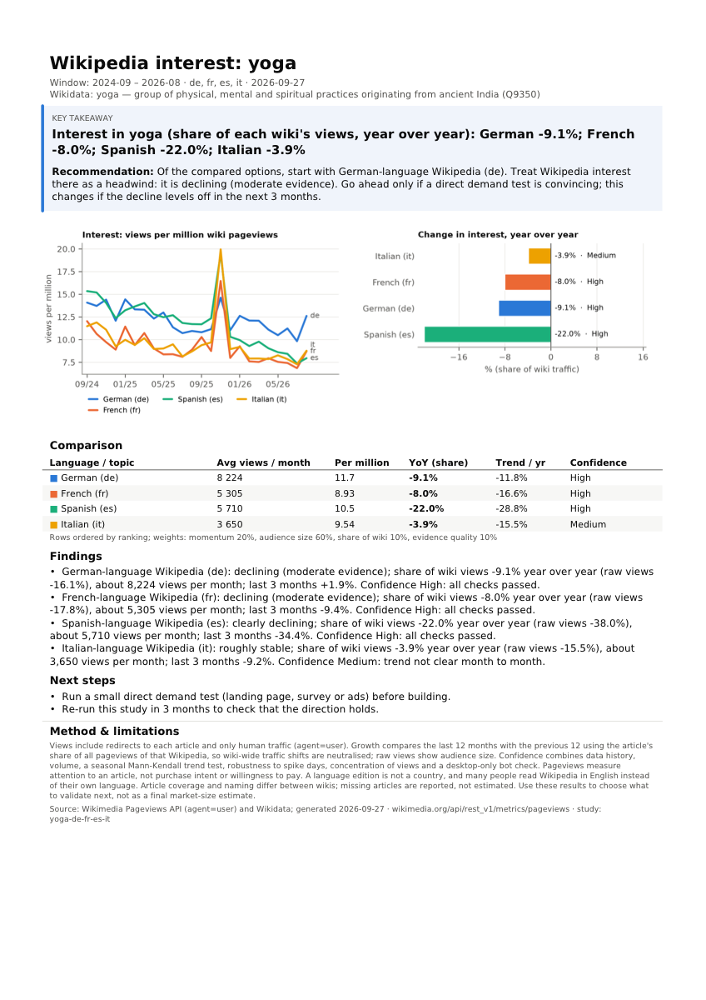

# Wikipedia Interest Research — Agent Skill

An [Agent Skill](https://agentskills.io/specification) that helps B2C founders decide **which topics to
build next and which languages to launch in**, using [Wikimedia pageview data](https://doc.wikimedia.org/generated-data-platform/aqs/analytics-api/reference/page-views.html).
The agent answers questions such as *"Is interest in astronomy growing on Ukrainian Wikipedia, and can we
trust it?"* with trend numbers, an explicit confidence level, charts and a shareable one-page PDF.

It is designed to work reliably on **fast, inexpensive models** (tested on Claude Haiku 4.5 and the free
Nemotron 3 Super on OpenRouter): all data work, statistics, wording and fact-checking are done by code; the
model maps the request to parameters and translates a verified draft.

> **Українською.** Навичка для AI-агента, яка за переглядами статей Вікіпедії відповідає, чи зростає інтерес
> до теми в різних мовних розділах і наскільки цьому можна довіряти, та готує графіки й PDF-звіт на одну
> сторінку. Уся робота з даними й перевірка висновків виконуються кодом, тож навичка стабільно працює навіть
> на дешевих моделях.

---

## Example

**User:** *"For our fitness app, compare interest in yoga across German, French, Spanish and Italian
Wikipedia. We care mostly about audience size, momentum matters less. Which market should we localise into first?"*

**What the agent runs:**

```bash
wpv run --topic yoga --langs de,fr,es,it --weights volume=0.6,growth=0.2,share=0.1,confidence=0.1
wpv check --study wiki-interest-studies/yoga-de-fr-es-it --answer answer.md   # self-check before sending
# wpv report --lang <code> ...  only if the user writes in a language other than English
```

**Answer (excerpt, generated from the verified draft):**

> **Interest in yoga:** on German-language Wikipedia it is *declining (moderate evidence)*: its share of that
> wiki's views changed **−9.1%** over the last 12 months vs the previous 12; French −8.0% (moderate evidence);
> Spanish **clearly declining**, −22.0%; Italian *roughly stable*, −3.9%.
>
> - German-language Wikipedia: about **8,224 views/month** (9,797 in the previous 12 months). *Confidence High:*
>   24 months of data, solid audience (median 259 views/day), statistically clear trend, not driven by spikes.
> - Ranking by the stated criteria (audience size 60%, momentum 20%, share 10%, evidence 10%):
>   1. German, 2. French, 3. Spanish, 4. Italian; *trade-off: judged on momentum alone, Italian would lead.*
> - Limits: these are readers of language editions, not countries (German-language Wikipedia is read in
>   Germany, Austria and Switzerland); pageviews measure attention, not willingness to pay.
>
> **Recommendation:** start with German-language Wikipedia, but treat Wikipedia interest there as a headwind;
> go ahead only if a direct demand test is convincing.

**Shareable report** (`report-en.pdf`, one A4 page):



---

## Quick start

**Requirements:** Python ≥ 3.11, bash, internet access. No API keys.

```bash
git clone https://github.com/Nujabesuuu/wiki_search_skill.git
# use with Claude Code (or any agent that supports Agent Skills)
cp -r wiki_search_skill/wiki-interest-research ~/.claude/skills/
```

The first call of `scripts/wpv` creates an isolated `.venv` from pinned requirements (numpy, matplotlib,
reportlab; about a minute); later calls start instantly. The CLI can also be used directly:

```bash
S=wiki_search_skill/wiki-interest-research
$S/scripts/wpv run --topic "intermittent fasting" --langs pl,cs --months 24
$S/scripts/wpv run --study wiki-interest-studies/intermittent-fasting-pl-cs --add-langs de   # follow-up, cached
$S/scripts/wpv --help
```

Tests: `cd $S && python3 -m venv .venv && .venv/bin/pip install -r scripts/requirements-dev.txt && .venv/bin/python -m pytest` (104 offline tests).

---

## How it works

```
 user question
      │
 ┌────▼──────────────────────────── agent (small model) ────────────────────────────┐
 │ map to topic(s) + language codes + window (+ weights if the user has criteria)    │
 └────┬──────────────────────────────────────────────────────────────────────────────┘
      │ wpv run
 ┌────▼────────────────────────────────── code ─────────────────────────────────────┐
 │ resolve   topic → Wikidata item → article per language (+ redirects)              │
 │ fetch     daily pageviews (human traffic), SQLite cache, only missing days        │
 │ analyze   share of wiki traffic, YoY, robust trend, seasonal test, spikes, bots   │
 │ grade     confidence High/Medium/Low/Insufficient + the claims the data allows    │
 │ rank      weighted, user-adjustable criteria                                      │
 │ draft     complete answer + PDF text with correct hedging, reasons and limits     │
 │ report    charts + one-page PDF (7 languages), every number verified              │
 └────┬──────────────────────────────────────────────────────────────────────────────┘
      │ JSON: results, reporting_rules, draft
 ┌────▼────────────────────────────────── agent ────────────────────────────────────┐
 │ translate the draft, adapt the recommendation → wpv check → send                  │
 └───────────────────────────────────────────────────────────────────────────────────┘
```

### Measuring interest
- **Topic → articles** via Wikidata sitelinks. Candidates are ranked by whether they have articles in the
  requested languages, so "English as a second language" maps to the concept, not a TV episode with that
  name. Equally plausible meanings (*Mercury*: planet / element / god) are flagged as ambiguous.
- **Redirect views are included** (*OMAD*, *5:2 diet* → *Intermittent fasting*).
- **Only human traffic** (`agent=user`), all devices; desktop views are kept separately for bot detection.
- **Headline metric: change in the article's share of all pageviews of that wiki**, last 12 months vs the
  previous 12. Whole Wikipedias gain and lose traffic (Ukrainian −25% year over year, Turkish −16%), so raw
  views would show "declining interest" almost everywhere; share also makes wikis of different sizes comparable.
- A missing article is reported as a finding, never estimated.

### How much to trust a trend
Six explicit checks produce the confidence grade; each failed check is explained in plain words:

| check | why |
|---|---|
| ≥ 24 months of data, article existed all along | year-over-year needs two years; a new article fakes growth |
| median ≥ 30 views per day | on small articles, percentages are noise |
| seasonal Mann-Kendall test (p < 0.05) | the trend is real month to month; each month is compared with the same month |
| robust to spike days | growth must survive removing news/viral days |
| top 5 days ≤ 15% of views | interest is spread over the year |
| no desktop-only spikes | typical signature of unflagged bots |

The grade determines the strongest allowed wording: *clearly growing*, *growing (moderate evidence)*,
*possibly growing*, *roughly stable*, *too little data*. Spikes that recur on the same date every year
(e.g. the school year start for *astronomy*) are labelled seasonal, not news.

### Keeping the agent honest
- **Draft written by code:** `run` returns a complete answer and PDF text: verdict per language, share vs raw
  change, audience size, confidence reasons, recent months, spikes, comparisons, ranking with weights and
  trade-off, limits and a data-based recommendation. The model translates it and adapts the recommendation.
- **Report verification:** `wpv report` rejects any number that does not match the data (understands
  `8 178`, `47,7 %`, `8.2k`, `8,2 тис.`, `3.2x`), claims stronger than the confidence allows, overstating words
  and country names used instead of language editions.
- **Answer self-check:** `wpv check` flags unknown numbers, country names, cross-language generalisations,
  dropped lines and a missing report path, so the agent fixes its answer before sending it.
- **Follow-ups are cheap:** each study is saved (`--add-langs`, `--months 36`, `--weights …`), data is cached.

---

## Key design decisions

| decision | reason |
|---|---|
| Python CLI with one JSON object on stdout and a hint on every error | easy for any agent to call and recover from |
| Code writes the answer; the model translates it | evaluations: numbers were always right, points were lost in the model's own wording |
| Share of wiki traffic as the headline metric | removes wiki-wide traffic shifts; comparable across languages |
| Confidence as named checks, not a black-box score | the user sees *why* a result can or cannot be trusted |
| Language edition ≠ country, stated everywhere | the most common misreading of this data |
| SQLite cache with date-range coverage | follow-up questions cost almost no API calls |
| English PDF built automatically by `run` | small models tended to skip the report step |

---

## Evaluation

Seven scenarios (the three task examples, a two-turn follow-up, custom ranking criteria, an ambiguous topic
and a casual prompt that does not mention Wikipedia) were run by fresh agents that could see only the skill
(no tests or expected answers). A separate strict grader scored each run out of 100, with automatic
penalties for invented numbers, overclaims and a missing PDF; `evals/check_outputs.py` added objective checks.

| round | change | result (Claude Haiku 4.5) |
|---|---|---|
| 1 | model writes the answer from computed data | mean 53 |
| 2 | code writes per-language sentences | mean 52 |
| 3 | code writes the whole answer and the recommendation | mean 61, best 82–85 |
| 4–5 | English PDF built by `run`; `wpv check` self-check | ≈ 85–88 on the hardest scenario, all objective checks pass (also on free Nemotron 3 Super) |

Rounds 4–5 were small targeted runs graded against the same rubric. Per-run details and example answers:
[`evals/results/`](wiki-interest-research/evals/results/README.md). The main finding: the data layer was
correct from the first run, and almost all lost points came from free-form model text, which is why wording
and checking moved into code.

---

## Limitations
- Pageviews measure attention (curiosity, study, news), not purchase intent: use results to choose what to
  validate next, not as a market-size estimate.
- A language edition is not a country; many people read English Wikipedia instead of their own language.
- One article per language is a proxy for a whole subject; baskets of articles help (`--topic "label=Q1,Q2"`).
- Wikimedia's bot filter is imperfect; only obvious desktop-only spikes are detected.
- Report labels exist in 7 languages (en, uk, pl, cs, de, es, fr); PDF fonts cover Latin, Cyrillic and Greek.

## Roadmap
1. **Better topic coverage:** automatic baskets from Wikidata (subclasses, parts), scored proxy articles for
   missing languages, topic labels in the report language.
2. **More signals:** per-country readership (Wikimedia country data), views per speaker, clickstream (where
   readers come from), seasonality profiles for launch timing, short-term forecasts with intervals.
3. **Larger research:** replace the API fetcher with monthly pageview dumps loaded into DuckDB/Parquet to
   screen thousands of articles × dozens of languages; a `screen` command that returns only the top options;
   scheduled refresh of saved studies.
4. **Evaluation in CI:** run the scenario matrix on every change to `SKILL.md` or the draft generator; turn
   more grader findings into automatic checks.

## Repository layout
```
README.md
wiki-interest-research/            the skill (all code and materials)
├── SKILL.md                       agent workflow (6 steps)
├── references/                    methodology and CLI reference (loaded on demand)
├── scripts/wpv                    launcher (pinned virtualenv on first run)
├── scripts/wiki_interest/         resolve, fetch, cache, stats, analyze, rank, draft, verify, report, check
├── assets/                        example report image
├── tests/                         104 offline unit tests
└── evals/                         scenarios, rubric, objective checks, OpenRouter runner, results
```
